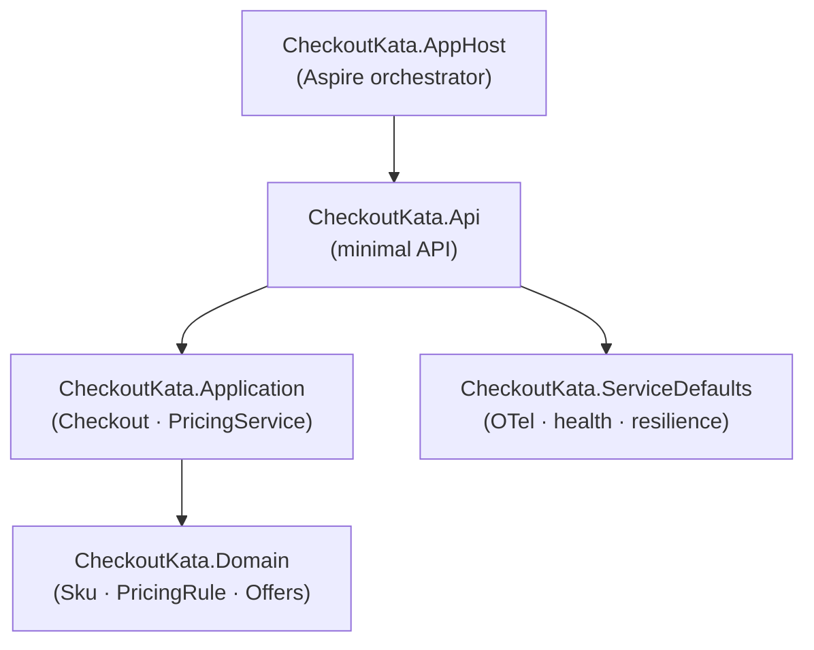

# checkout-kata

The classic supermarket checkout kata, deliberately grown into a small
**clean-architecture showcase**: a Domain/Application split, a stateless pricing
service, architecture tests that enforce the layering, and .NET Aspire
orchestration — while keeping the original hardening (Result pattern, guard
clauses, checked arithmetic, a never-overcharge cap, property + mutation tests).

> This is intentionally more than a 4-SKU kata needs. It demonstrates "what a
> real service would look like." The reasoning — and where ceremony was
> deliberately *not* added — is recorded in [ENGINEERING-NOTES.md](ENGINEERING-NOTES.md).

## The kata

In a normal supermarket, products are identified using Stock Keeping Units, or SKUs. In our supermarket, we’ll use individual letters of the alphabet (A, B, C, and so on). Our goods are priced individually. In addition, some items are multipriced: buy _n_ of them, and they’ll cost you _y_. For example, item ‘A’ might cost 50 pounds individually, but this week we have a special offer; buy three ‘A’s and they’ll cost you 130. The current pricing and offers are as follows:

| SKU  | Unit Price | Special Price |
| ---- | ---------- | ------------- |
| A    | 50         | 3 for 130     |
| B    | 30         | 2 for 45      |
| C    | 20         |               |
| D    | 15         |               |

Our checkout scans items individually and accepts items in any order, so that if we scan a B, an A, and another B, we’ll recognize the two Bs qualify for a special offer for a a total price of 95. You can qualify for a special offer multiple times e.g. if you scan 6 As then you will have a total price of 260. Because the pricing changes frequently, we need to be able to pass in a set of pricing rules each time we start handling a checkout transaction.

Here's a suggested interface for the checkout...
```cs
interface ICheckout
{
    void Scan(string item);
    int GetTotalPrice();
}
```

> In this implementation `Scan` returns a `Result` (Success / NotFound / Invalid)
> rather than `void`, so a caller can't silently drop an unknown SKU — see ADR-001
> in the engineering notes.

## Architecture

Dependencies point inwards: the domain depends on nothing but guard clauses, and
the outer layers depend on the inner ones — never the reverse. The architecture
tests make this executable.



| Project | Responsibility | Depends on |
| --- | --- | --- |
| `CheckoutKata.Domain` | `Sku`, `PricingRule`, `IOffer` + offers | `Ardalis.GuardClauses` only |
| `CheckoutKata.Application` | `Checkout` (scan state), `PricingService` (totals) | Domain, `Ardalis.Result` |
| `CheckoutKata.Api` | minimal API (`POST /checkout/total`) | Application, Domain, ServiceDefaults |
| `CheckoutKata.ServiceDefaults` | Aspire defaults: OTel, health, resilience | — |
| `CheckoutKata.AppHost` | Aspire orchestrator | Api |

## Usage

```csharp
using CheckoutKata.Application;
using CheckoutKata.Domain;
using CheckoutKata.Domain.Offers;

// 1. Define the catalog. Offers plug in behind IOffer (MultiBuyOffer, BuyXGetYFreeOffer, ...).
PricingRule[] rules =
[
    new("A", 50, new MultiBuyOffer(quantity: 3, specialPrice: 130)),
    new("B", 30, new MultiBuyOffer(quantity: 2, specialPrice: 45)),
    new("C", 20),
    new("D", 15),
];

// 2. Scan items in any order. Scan returns a Result you should inspect.
var checkout = new Checkout(rules);
checkout.Scan("B");
checkout.Scan("A");
checkout.Scan("B");

int total = checkout.GetTotalPrice(); // 95

// Or price a whole basket statelessly via the pricing engine directly:
var pricing = new PricingService(rules);
int basketTotal = pricing.CalculateTotal(new Dictionary<Sku, int> { ["A"] = 3 }); // 130
```

## Running the service

Launch everything through the Aspire AppHost (starts the dashboard and the API):

```bash
dotnet run --project src/CheckoutKata.AppHost
```

The dashboard prints the `checkout-api` endpoint. Hit the stateless pricing endpoint
(the whole basket goes in one request):

```bash
curl -X POST http://localhost:<port>/checkout/total \
  -H "Content-Type: application/json" \
  -d '{"items":{"B":2,"A":1}}'
# {"total":95}
```

To run the API on its own (without Aspire) it listens on `http://localhost:5080`:

```bash
dotnet run --project src/CheckoutKata.Api
```

**Errors** use RFC 9457 `application/problem+json`. Bad input (unknown/blank SKU, negative
quantity) returns a `400` validation problem; anything unexpected returns a generic `500` with no
internal detail (logged server-side, correlated by `traceId`). For example, an unknown SKU:

```json
{
  "title": "One or more validation errors occurred.",
  "status": 400,
  "errors": { "Z": ["No pricing rule for this SKU."] },
  "traceId": "00-..."
}
```

## Testing

```bash
dotnet test                                      # unit + property + architecture tests
dotnet stryker -f stryker-config.Domain.json     # mutation testing, per project
dotnet stryker -f stryker-config.Application.json
dotnet csharpier check .                          # formatting
```

# Instructions
Implement a class or classes that satisfies the problem described above. The solution should include unit tests, and we welcome test first approaches to it.

We're as interested in the process that you go through to develop the code as the end result, so commit early and often so we can see the steps that you go through to arrive at your solution. We want to see a git repository containing your solution, ideally uploaded to your own github account. 

# Acknowledgements
Adapted from http://codekata.com/kata/kata09-back-to-the-checkout/
